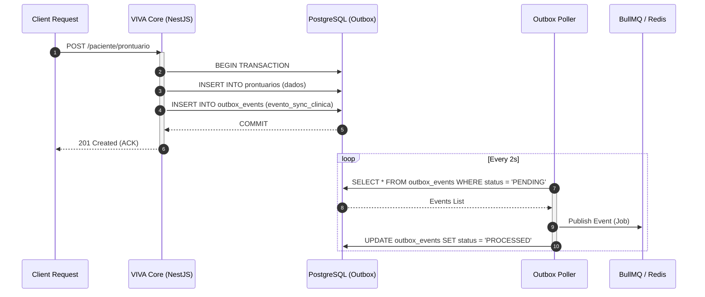

<!-- HEADER ANIMADO E DINÂMICO (DARK/LIGHT MODE) -->

  <picture>
    <source media="(prefers-color-scheme: dark)" srcset="https://readme-typing-svg.herokuapp.com?font=Fira+Code&weight=600&size=24&pause=1000&color=FFFFFF&center=true&vCenter=true&width=600&lines=Software+Engineer;Applied+AI+%26+Integrations;Cloud+FinOps+Enthusiast">
    
  </picture>

<!-- LINKS SOCIAIS MINIMALISTAS -->

   
  
  &nbsp;
  
  &nbsp;
  
  &nbsp;
  
   
   

---

## ✦ Sobre Mim

> **Engenharia de Stakeholders & Soluções Centradas no Usuário**

Graduando em Engenharia de Software (FATEC) e Pesquisador de IA (CNPq), combinando rigor acadêmico com 5+ anos de experiência prévia em Customer Experience (Varejo). Essa trajetória me garante forte "Engenharia de Stakeholders" e um foco inabalável em arquitetar soluções que resolvem dores reais de negócio.

Atualmente, minha atuação técnica está concentrada nos pilares de:
- **Inteligência Artificial (Applied AI):** Implementação de arquiteturas RAG (Local/Cloud) e IA Semântica isolada.
- **Backend & Integrações:** Construção de sistemas distribuídos resilientes utilizando Webhooks e padrões como *Transactional Outbox*.
- **Cloud FinOps:** Design de infraestrutura com foco absoluto em *Zero OpEx* e *Unit Economics* escaláveis.

 

## ✦ Tech Stack Principal

> Ferramental consolidado para construção de sistemas distribuídos e IAs aplicadas.

| Core & Runtimes | Data & Messaging | Infra & Cloud | Frontend & UI |
| :---: | :---: | :---: | :---: |
|  |  |  |  |

 

---

## ✦ Cases de Arquitetura (System Design / Private Repos)

Abaixo estão arquiteturas que projetei e implementei em cenários de alta complexidade de negócio e integrações críticas.

### 1. WSP Finance (SaaS B2B2C)
Plataforma financeira desenhada com foco em auditoria automatizada e otimização agressiva de custos operacionais.
- **Linter Fiscal:** Motor de IA Semântica isolada utilizando Google Vertex AI para análise e validação de regras de negócio em documentos fiscais.
- **Infraestrutura Zero OpEx:** Armazenamento em larga escala de notas fiscais utilizando Cloudflare R2, eliminando completamente as taxas de egresso tradicionais.

### 2. Ecossistema VIVA (HealthTech)
Ecossistema de saúde focado em processamento assíncrono de alto volume e inferência de dados sensíveis. Construído com NestJS.
- **Stack de Alta Performance:** Orquestração de filas com BullMQ, caching e *rate-limiting* via Redis.
- **RAG Local:** Implementação de Retrieval-Augmented Generation *on-premise* utilizando \`sqlite-vec\` para garantia de privacidade de dados médicos (*Zero-Trust*).

**Padrão de Resiliência: Transactional Outbox**
Implementado para garantir consistência eventual em integrações de sistemas legados de clínicas, onde a estabilidade da rede não é garantida:

### 3. Samurai Pro (Plataforma de Automação B2B)
Motor de automação e integração de processos de negócio, construído com foco em escalabilidade e tolerância a falhas.
- **Core:** Desenvolvido em Python (FastAPI), conteinerizado via Docker.
- **Workflow & Orquestração:** Fluxos complexos orquestrados de forma declarativa via n8n.
- **Auto-healing com IA:** Utilização de IA Multimodal (GPT-4o Vision) para identificar quebras de UI em automações web e disparar rotinas de autocorreção (*Thread* de recuperação).

 

---

## ✦ Cloud Unit Economics & FinOps (ADR)

> **Decisão Arquitetural de Armazenamento:** AWS S3 vs Cloudflare R2 para WSP Finance

Como Engineering Manager, priorizo o design de arquiteturas que não apenas escalam tecnicamente, mas também financeiramente. A tabela abaixo ilustra a projeção de economia (FinOps) no armazenamento de 5TB de notas fiscais com 2TB de egresso mensal.

| Provedor / Serviço | Custo Storage (5TB) | Custo Egresso (2TB) | Custo Total Mensal | Impacto (Anualizado) |
| :--- | :---: | :---: | :---: | :---: |
| **AWS S3** (Standard) | ~$115.00 | ~$180.00 | **~$295.00** | ~$3,540.00 |
| **Cloudflare R2** | ~$75.00 | **$0.00** | **~$75.00** | **~$900.00** |

**Decisão (ADR):** A escolha pelo Cloudflare R2 reduziu o custo projetado de egresso a **zero**, gerando uma economia estimada de aproximadamente **74%** ao mês. Este design *Zero OpEx* de egresso é fundamental para manter a margem do produto B2B2C sustentável em larga escala.

 

---

<!-- INSERIR GITHUB 3D CONTRIB AQUI -->
<!--
Lembrete: Ativar a GitHub Action 'github-profile-3d-contrib'
(https://github.com/yoshi389111/github-profile-3d-contrib)
para gerar o skyline tridimensional de contribuições nesta seção.
Isso substituirá os "Stats Cards" tradicionais por uma visualização
impactante e elegante da sua constância de código.
-->

  
<i>Gráfico de Contribuições 3D (Skyline) a ser renderizado via Action.</i>

 

  
<i>"Code is poetry, architecture is strategy."</i>

